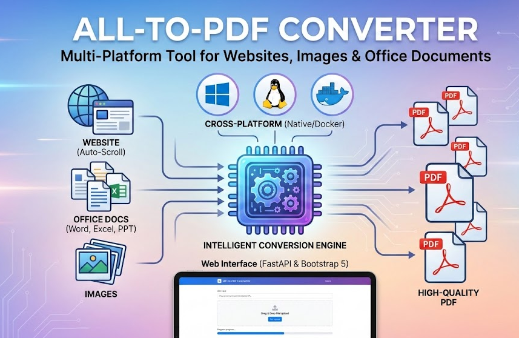
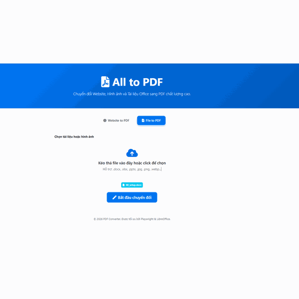
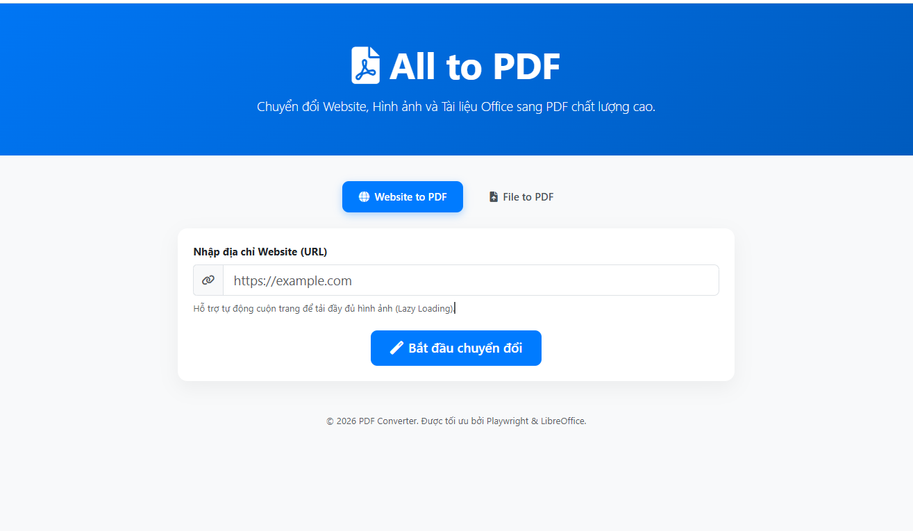
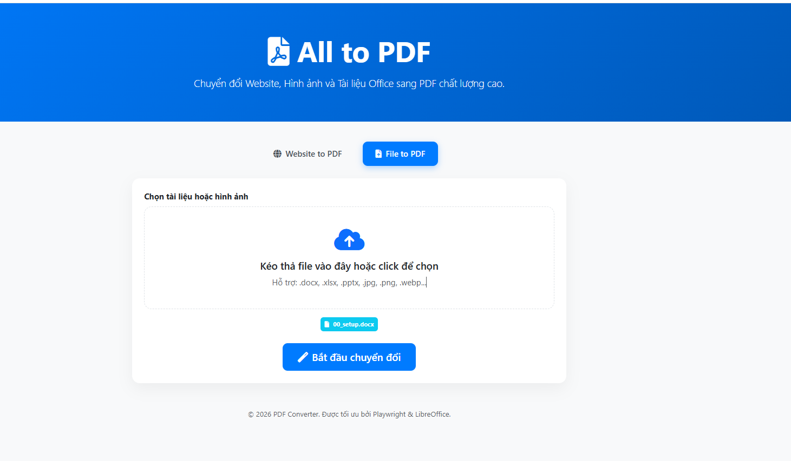
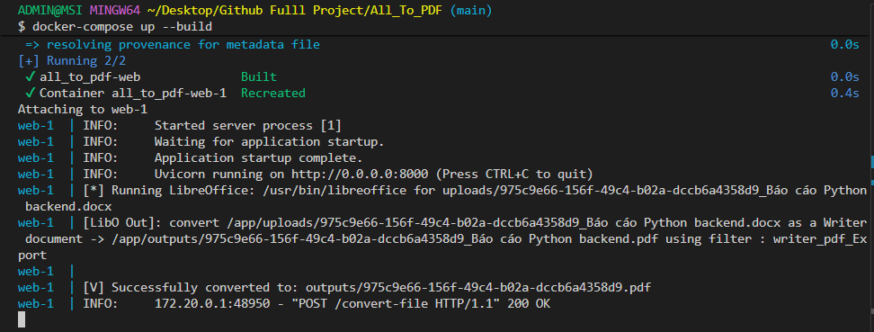
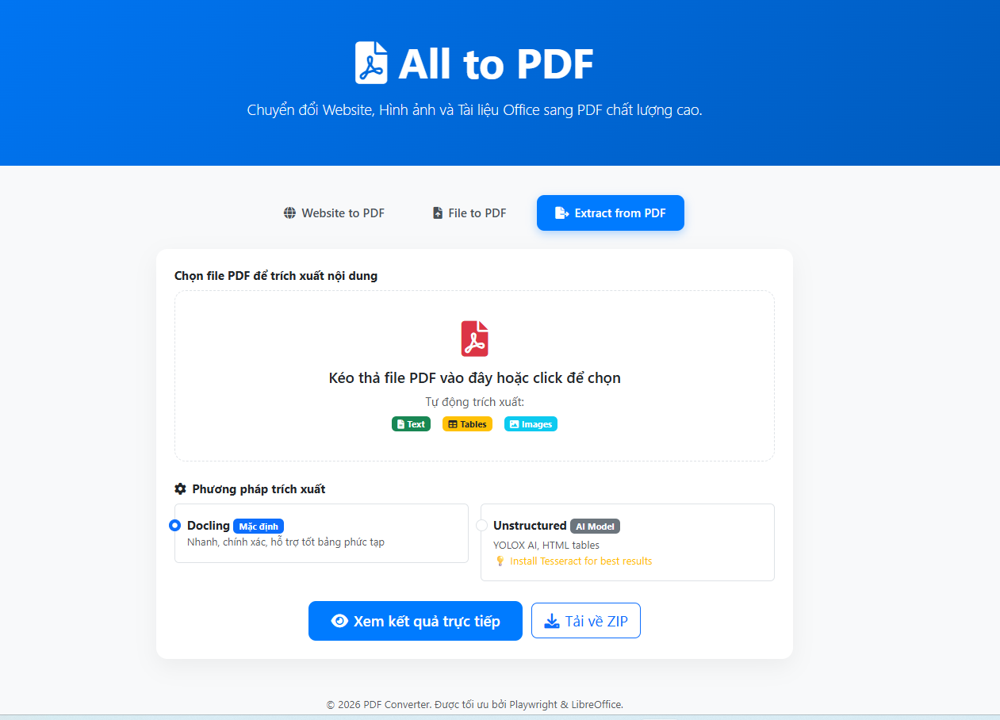
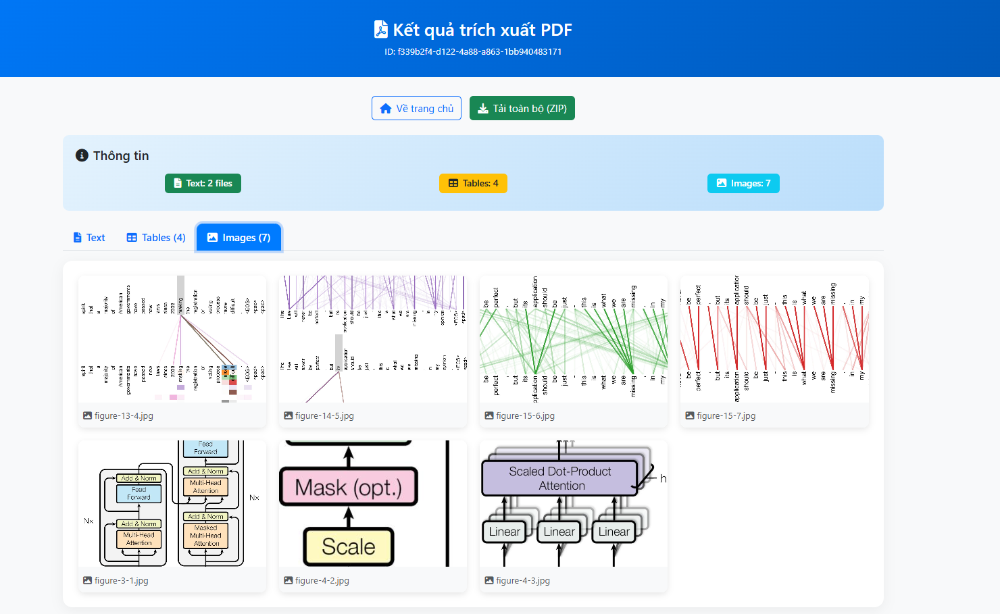

# 📄 All-to-PDF Converter (Multi-Platform)

A tool for converting Websites, Images, and Office Documents (Word, Excel, PPT) to high-quality PDF. Runs on both **Windows** and **Linux** (Native or Docker).

<p align="center">
  
</p>

## 🌟 Key Features
- **Cross-Platform**: Automatically detects the OS to select the best conversion engine.
- **Windows Optimized**: Directly uses Microsoft Office (Word, Excel, PowerPoint) if available on the machine.
- **Linux/Docker Ready**: Integrates LibreOffice for server or container environments.
- **Website to PDF**: Auto-scrolls the page to handle lazy-loading images, ensuring no image is missing.
- **PDF Content Extraction**: Powered by **Docling** to extract structured text, tables (Excel/CSV), and images from PDF files without complex system dependencies.
- **Web Interface**: Built with FastAPI & Bootstrap 5, supports drag-and-drop file upload and displays processing status.

---

## 📸 Screenshots

### 🌐 Web to PDF - Website to PDF Conversion Interface
An interface that allows users to enter any website URL to convert it to PDF. Supports auto-scrolling to load all content, including lazy-loaded images. The interface shows the processing progress and allows downloading the resulting PDF file.


### 📁 File to PDF - File to PDF Conversion Interface
A simple and intuitive drag-and-drop file interface. Supports converting multiple Office document formats such as Word (.doc, .docx), Excel (.xls, .xlsx), PowerPoint (.ppt, .pptx), and various image formats to high-quality PDF. Users can drag and drop or click to select the files for conversion.


### 🐳 Docker Logs - Logs when running Docker
An illustration of the application startup process using Docker Compose. The container is automatically built with all necessary dependencies (Python, LibreOffice, Playwright, Chromium). Logs show the FastAPI server running and ready to accept requests on port 8000.


### ⚙️ PDF Extraction Options - Extraction Method Selection
An interface that allows users to choose between **Docling** and **Unstructured** for PDF extraction. 

* **Docling:** Nhanh, chính xác, hỗ trợ bảng phức tạp.
* **Unstructured:** Sử dụng YOLOX AI, phù hợp cho layout phức tạp.



---

### 🖼️ Extraction Results - Visualizing Extracted Content
A preview of the extracted results showing images, tables, and text captured from the PDF. 

> **Note:** Users can view high-quality extracted images and structured data directly in the browser.



---

## 🚀 Installation & Running Guide

### Method 1: Run with Docker (Recommended - Fastest)
You don't need to install Python or LibreOffice on your host machine. Docker will automatically package everything.
```bash
docker-compose up --build
```
Then access: `http://localhost:8000`

### Method 2: Run Natively on Machine

**1. Install Python Dependencies:**
```bash
pip install -r requirements.txt
playwright install chromium
```

**2. System Requirements:**
- **Windows**: Microsoft Office installed is preferred. If not available, install LibreOffice.
- **Linux**: Install LibreOffice (`sudo apt install libreoffice`).

**3. Start the application:**
```bash
python app.py
```
Access: `http://localhost:8000`


---

## 💻 Method 3: Run Natively (Recommended for Development)

### Step 1: Create and Activate a Virtual Environment (Venv)

Inside the `All_To_PDF` folder, run:

```bash
python -m venv venv
source venv/Scripts/activate
```

> On Windows PowerShell:
```powershell
venv\Scripts\activate
```

---

### Step 2: Install Everything in One Command

Copy and paste the line below into your terminal.  
It will automatically install the latest compatible versions of all required dependencies:

```bash
pip install fastapi uvicorn python-multipart playwright pillow nest_asyncio jinja2 pywin32 docling pandas openpyxl httpx unstructured[all-docs]
```

---

### Step 3: Install Browser for Playwright

Since this project uses `playwright`, you must install Chromium:

```bash
playwright install chromium
```

Without this step, the Web-to-PDF feature will fail when running the application.

---

### Step 4: Start the Application

```bash
python app.py
```

Then open:

```
http://localhost:8000
```

---

## 🎯 Why You SHOULD Use a Virtual Environment

1. **Clean Setup**  
   The virtual environment installs the newest compatible versions of libraries.  
   Errors like:

   ```
   ImportError: cannot import name 'AutoProcessor'
   ```

   will disappear completely.

2. **Isolation**  
   If you later install another tool that requires older libraries, it will NOT break your `All_To_PDF` project.

3. **One-Time Configuration**  
   After setup, you only need:

   ```bash
   source venv/Scripts/activate
   ```

   and you're ready to work — no reinstalling required.

---

## 🔍 OS-based Operating Mechanism

| Component | Windows (Native) | Linux / Docker |
| :--- | :--- | :--- |
| **Website** | Playwright (Chromium) | Playwright (Chromium) |
| **Office Docs** | **Microsoft Office** (via pywin32) | **LibreOffice** (soffice) |
| **Images** | Pillow (PIL) | Pillow (PIL) |
| **PDF Extraction**| **Docling** / Unstructured | **Docling** / Unstructured |

---

## 🛠 Project Structure
- `app.py`: FastAPI server, Intelligent conversion & PDF extraction logic (Docling/Unstructured).
- `templates/index.html`: Web user interface.
- `Dockerfile` & `docker-compose.yml`: Containerization configuration.
- `uploads/` & `outputs/`: Temporary directories (automatically cleaned after 60 seconds).
- `extracted/`: Directory for PDF extraction results (cleaned after 2 minutes).

---

## 📤 NEW: PDF Content Extraction

### Features
Extract comprehensive content from PDF files using powerful extraction engines:
- 📝 **Text**: High-fidelity Markdown and plain text formats.
- 📊 **Tables**: Multi-format extraction (CSV and Excel `.xlsx`) with structure preservation.
- 🖼️ **Images**: Individual image extraction saved as high-quality PNGs.
- 🔍 **View Mode**: Preview extracted text, tables, and images directly in your browser before downloading.

### Extraction Methods

#### 1️⃣ Docling (Default - Recommended)
- ✅ **No extra dependencies** - Works out-of-the-box on Windows
- ⚡ Fast and accurate
- 📊 Excellent table structure preservation
- 🎯 Best for: Digital PDFs with complex tables

#### 2️⃣ Unstructured (Advanced - AI Model)
- 🤖 Uses YOLOX AI model for layout detection
- 📑 Exports tables as HTML + CSV + Excel
- 🎯 Best for: Complex document layouts, scanned PDFs
- ⚠️ **Recommendation**: Install Tesseract for best results with tables and images
  - Without Tesseract: Limited extraction (text only, fewer tables/images)
  - With Tesseract: Full hi-res extraction (like the notebook demo)

### How to Use
1. Navigate to the **"Extract from PDF"** tab.
2. Upload your PDF file (drag & drop or click to select).
3. **Choose extraction method**:
   - **Docling** (Default): Fast, no dependencies
   - **Unstructured**: AI-powered, better for complex layouts
4. Click **"View directly"** to preview results in browser
5. Or click **"Download ZIP"** for the complete package

### Output Structure
```
extracted_result.zip
├── text/
│   ├── extracted_text.md      (Markdown format with structure)
│   └── extracted_text.txt     (Plain text for easy searching)
├── tables/
│   ├── table_1.csv            (Raw data)
│   ├── table_1.xlsx           (Formatted for Excel)
│   ├── table_1.html           (HTML format - Unstructured only)
│   └── ...
├── images/
│   ├── image_1_page_3.png     (Extracted visual assets)
│   └── ...
└── summary.txt                (Detailed extraction report)
```

### Requirements & Tech
- **Docling**: Primary engine, works without system dependencies
- **Unstructured**: Optional AI-powered method
  - ✅ Works without dependencies but with **limited extraction**
  - 🔥 **Install Tesseract for full power**: Tables, images, and hi-res layout detection
- **Pure Python**: Works on Windows without Poppler
- **Automatic Cleanup**: Files deleted after 10 minutes (view) or 2 minutes (download)

### Recommended: Tesseract OCR (for Unstructured full features)
To unlock **full extraction capabilities** of Unstructured (as shown in the notebook):

**Quick Install:**

**Windows:** Download from https://github.com/UB-Mannheim/tesseract/wiki → Add to PATH

**Linux:** `sudo apt install tesseract-ocr`

**Docker:** Already included

**📘 Detailed guide:** See [TESSERACT_INSTALL.md](TESSERACT_INSTALL.md) for step-by-step instructions

**After installing Tesseract:** Restart the app, then Unstructured will automatically use hi-res strategy for better table and image extraction! 🎉

For detailed instructions, see [EXTRACTION_GUIDE.md](EXTRACTION_GUIDE.md)

---

## ⚠️ Important Notes
- **Browser**: If you encounter a missing browser error on the first run, execute `playwright install chromium`.
- **Cleanup**: The system automatically deletes uploaded files and resulting PDFs after 1 minute for security and storage efficiency.
- **Docker**: The Docker image comes with LibreOffice pre-installed, making it very convenient for deployment on Linux servers.

---

## 🔗 Author

<div align="center">


<p align="center">
  <a href="https://github.com/Kietnehi">
    
  </a>
</p>

<h3>🚀 Truong Phu Kiet</h3>

<a href="https://github.com/Kietnehi">
  
</a>

<br/><br/>

<p align="center">
  
  
</p>

<p align="center">
  <a href="https://github.com/Kietnehi?tab=followers">
    
  </a>
  <a href="https://github.com/Kietnehi">
    
  </a>
</p>

<h3>🛠 Tech Stack</h3>
<p align="center">
  <a href="https://skillicons.dev">
    
  </a>
</p>
<p align="center">
  <b>Core Libraries:</b> FastAPI, Playwright, Docling, Unstructured, PyWin32, Pillow, Pandas
</p>

<br/>

<h3>🌟 All To PDF Converter</h3>
<p align="center">
  <a href="https://github.com/Kietnehi/All-To-PDF">
    
    
    
  </a>
</p>

<p align="center">
  
</p>
<p align="center">
<i>Thank you for stopping by! Don’t forget to give this repo a <b>⭐️ Star</b> if you find it useful.</i>
</p>


</div>

---